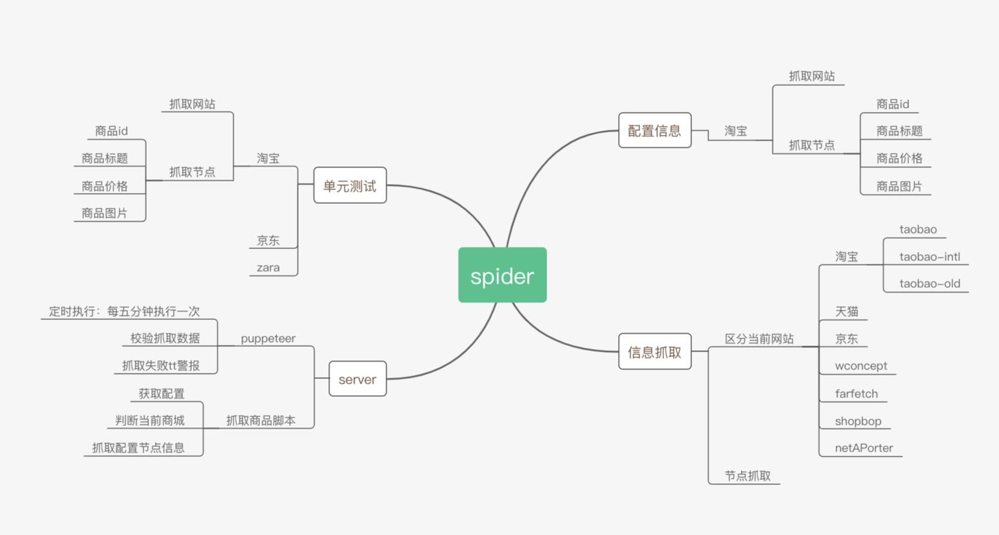

##业务

<<<<<<< HEAD
### 内容后台-广告管理

* prd: [广告管理](http://pmo.meili-inc.com/PMO/DM#pmoDetail?issueKey=REQUIRE-25445)
* 时间：1.5d
* 工作：
    * 视频播放
    * 广告轮播图
* 进度：已发布

### 内容后台-机构马甲号

* prd: 
* 工作：
    * 编辑、新增邮箱字段
    * 绑定、解绑马甲号
    * 联调测试
* 时间：2d
* 进度：已发布
* 问题：暂无

### meili-host工具

* 工作：
    * 数据库、服务迁移至腾讯云
* 进度：进行中
* 问题：
    * 迁移：由于之前host工具是在服务器上自己搭建的MongoDB数据库，迁移腾讯云后，PE建议将数据库改为MySQL(MongoDb数据库得另买不划算)，但迁移后原有的node服务中的mongoose代码得全部进行修改，成本较大，考虑还是先迁移到新服务器，自己搭数据库，后面再迁移MySQL
   * 遗留bug: 由于新同事都使用window电脑了，所以meili-host工具需要对window进行兼容，虽然electron是跨平台的但在兼容性上还存在一些问题，还存在一些代码层面的bug，后续会将其改掉，改完后，可以更大范围推广meili-host工具

### 技术

暂无
=======
## 内容后台-广告管理

* prd: [广告管理](http://pmo.meili-inc.com/PMO/DM#pmoDetail?issueKey=REQUIRE-25445)
* 工作：
    * 搜索框支持多用户搜索
    * 广告管理列表
    * 编辑、删除广告功能
    * 接口接入联调
* 进度：
    * 已发布
* 问题：运营同学那边希望，在广告页也播放视频，需要新增一个视频广告播放功能，已开发完，下周一发布

## 恋爱人格测试

上周五支持了一下，玩法需求。下面是数据统计，相对于一般的营销玩法如：0元夺宝，分享数据相对有明显上升,一般营销活动分享回流只能达到1%左右，本次活动分享回流数达到5%，但数据并不算亮眼

## 站外商品抓取

服务端定时抓取脚本已上线，目前整个功能架构如下：

近期规划：

* 抓取脚本、定时任务抓取信息配置化
* 抓取失败成功率数据可视化展示

### 技术

* node爬虫文档整理：[node-puppeteer](http://galaxy.mogujie.org/a/daogou-f2e/tech-docs/technology/spiders.html)
* 最近在看[Vue技术内幕](http://hcysun.me/vue-design/art/)感觉不错值得推荐

>>>>>>> f8dcce1098e86d40509f012d9ff867b199356073

