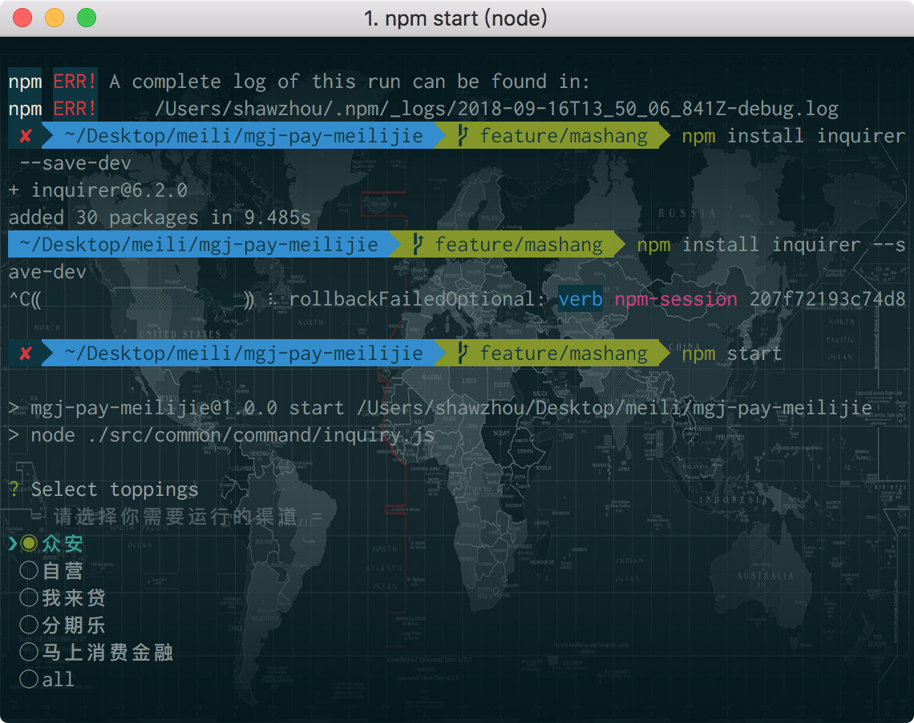

#支付金融－无线支付周报－@苏轼－2018年20周

## 本周工作回顾

### 日常需求

- [x] 修复客户端缓存
- [x] 美丽借-自营借款刷新缓存数据不正确
- [x] 美丽借-提示优化，减少客诉
- [x] 分期乐-借款记录增加麦田可配提示
- [x] 我来贷-借款记录增加麦田可配提示
- [x] 首页增加可借额度详解
- [x] 自营修改手机号，增加钱包修改入口
- [x] 借款结果审核中，修改提示文案
- [x] 美丽借马上消费金融渠道技术梳理

### 技术性工作

* [x] 将美丽借前端框架升级
* [x] 分渠道打包项目


## 下周工作计划

### 日常需求
```
1、美丽借前端框架升级
2、美丽借马上消费渠道启动
```

## 分享与吐槽
- 随着美丽借渠道增加，项目启动、开发体验越来越差，不得不进行框架升级，aides3升级成aides4遇到了诸多坑，最后生成的多页路由目前还存在问题待解决。尽管升级后，代码的热更新速度得到了提升，但因为多渠道原因项目已经十分臃肿，项目的启动时间，和开发体验上任然较差。期间考虑再三单独渠道有没有必要分出单独应用，最终还是决定集成在一个项目中，那如何解决多项目，启动时间慢，热更新慢的问题呢。通过选择渠道进行，分渠道打包项目，这样在开发过程中选择制定的一个或多个渠道分别启动，开发体验得到了极大的提高，最后的项目大概是这样子的：



