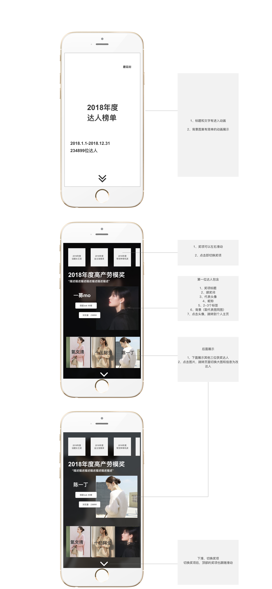

##2018年度达人项目日报 - 2018-1-5

### 需求

> 简版prd:

> 因需求紧急，周末加班一天

> 为加快项目进度、使用stage平台搭建

### 今日完成事项

* [x] 封面
* [x] 2018年度最具影响力博主奖
* [x] 2018年度色彩美学家奖
* [x] 2018年度时尚风向引领奖
* [x] 2018年度高产劳模奖
* [x] 2018年度话题女王奖
* [x] 2018年度时尚高端玩家奖
* [x] 2018年度带货种草机奖
* [x] 2018年度撩粉技能满点奖
* [x] 2018年度最佳量体搭衣奖
* [x] 2018年度金主宠爱奖
* [x] 2018年度实力圈粉奖 
* [x] 2018年度时尚MVP男选手
* [x] 结束页

## 当前风险点

1. 安卓机型进入年度榜单后非常不流畅，图片较多
2. 目录跳转，尚未完成、stage切换页面，需要和克瑞当面沟通
3. 在stage平台搭建页面，修改图片都是按照同比例缩放导致，实际页面跟设计图不一致
4. 今天多次stage平台部署失败
5. 无法创建14页以上、设置为所有页面的背景音乐失效，都需要手动修改stage.json文件，所需时间较长
6. 目录功能、14页以上都需要手动修改代码耗费时间较长

### 反思

1.评估时，黑子评估大概需要一周时间，但运营同学这边需要尽快上线开发时间，只有两天。压缩多开发时间，开发质量很低

2.紧急需要也需要，按照排好的时间开发，否则延期风险很大

